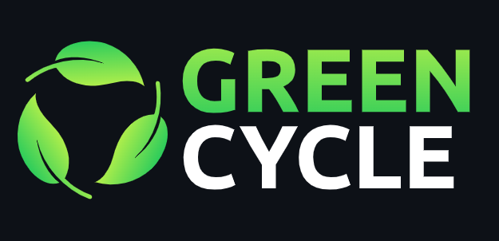

 

 A progressive <a href="http://nodejs.org" target="_blank">Node.js</a> framework for building efficient and scalable server-side applications.

 
 
 
 
 
 
 
 
 
 
 

# GreenCycle - Sistema de Gestión de Usuarios

GreenCycle es un robusto sistema de gestión de usuarios que proporciona funciones de autenticación y gestión de roles para administradores y usuarios. Construido con el poderoso framework Nest.js, esta aplicación permite a los usuarios registrarse, iniciar sesión y acceder a recursos protegidos según su rol. Los datos de usuarios y administradores se almacenan de forma segura en una base de datos MongoDB alojada en MongoDB Atlas.

## Características Principales

- **Autenticación y Autorización**: Registro e inicio de sesión de usuarios, generación y verificación de tokens JWT.
- **Gestión de Roles**: Soporte para roles de administrador y usuario, con control de acceso a recursos protegidos.
- **CRUD de Usuarios y Administradores**: Operaciones de creación, lectura, actualización y eliminación de usuarios y administradores.
- **Base de Datos MongoDB**: Integración con MongoDB Atlas para un almacenamiento de datos escalable y robusto.
- **Arquitectura Modular**: Diseño basado en módulos para una mejor organización y escalabilidad del código.
- **Seguridad Reforzada**: Cifrado de contraseñas, manejo de errores y validación de datos.

## Tecnologías Utilizadas

- **Nest.js**: Framework de Node.js para construir aplicaciones escalables y eficientes.
- **MongoDB**: Base de datos NoSQL flexible y escalable.
- **MongoDB Atlas**: Servicio de base de datos en la nube para alojar MongoDB.
- **JWT (JSON Web Tokens)**: Mecanismo de autenticación y autorización basado en tokens.
- **bcrypt**: Biblioteca para el cifrado seguro de contraseñas.

## Requisitos Previos

Antes de comenzar, asegúrate de tener instalados los siguientes requisitos:

- Node.js (versión 14 o superior)
- npm (versión 6 o superior)
- Una cuenta en MongoDB Atlas para la base de datos

## Instalación

1. Clona el repositorio: `git clone https://github.com/CDGA77/GreenCycle.git`
2. Navega al directorio del proyecto: `cd GreenCycle`
3. Instala las dependencias: `npm install`
4. Configura las variables de entorno (`.env`):
  - `DATABASE_URL`: URL de tu base de datos MongoDB Atlas
  - `JWT_SECRET`: Secreto para la generación de tokens JWT
  - `PORT`: Puerto en el que se ejecutará el servidor (por defecto: 5000)
5. Inicia el servidor de desarrollo: `npm run start:dev`
6. La aplicación estará disponible en `http://localhost:5000`

## Documentación

Para obtener más información sobre la estructura del proyecto, configuración, módulos, controladores, servicios, entidades y modelos de datos, dependencias, pruebas, seguridad y buenas prácticas, consulta la [Documentación Completa](ruta/al/archivo/de/documentacion.md).

## Contribución

Si deseas contribuir a este proyecto, sigue estos pasos:

1. Haz un fork del repositorio
2. Crea una nueva rama: `git checkout -b feature/nueva-funcionalidad`
3. Realiza tus cambios y haz commit: `git commit -m "Añadir nueva funcionalidad"`
4. Sube tus cambios: `git push origin feature/nueva-funcionalidad`
5. Abre un Pull Request en el repositorio original

## Licencia

Este proyecto está bajo la licencia MIT. Consulta el archivo [LICENSE](ruta/al/archivo/LICENSE) para obtener más detalles.

## Créditos

GreenCycle fue desarrollado por [Carlos Daniel Gaviria Aguiar](https://github.com/CDGA77).